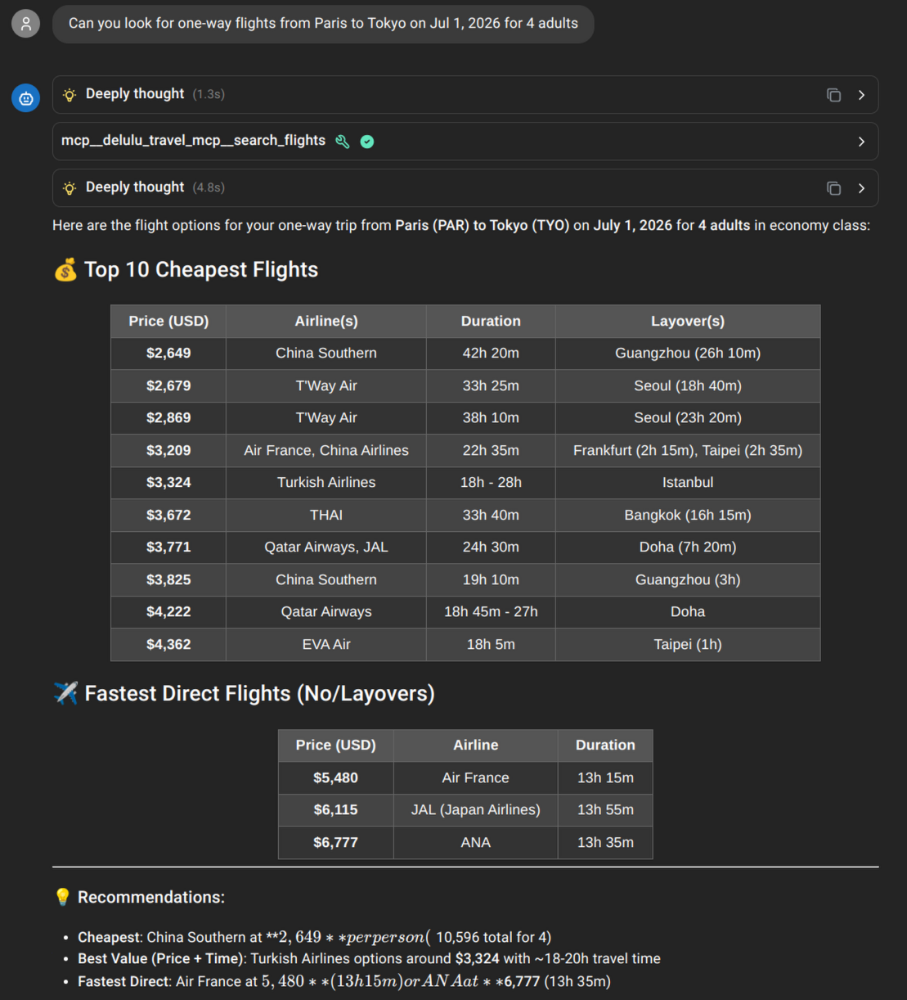
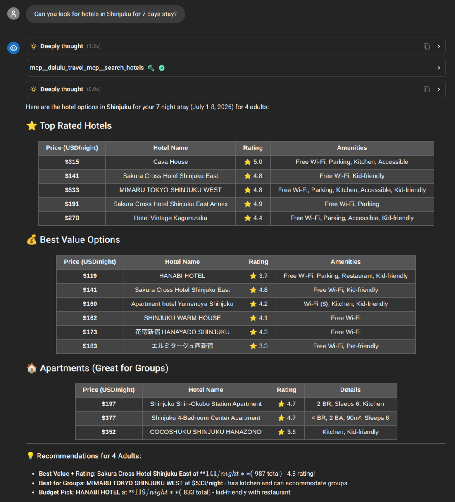

# Delulu - A suite of MCP tools to supercharge your LLM skillset

> [!TIP]
> _More knowing. Less guessing._

Delulu provides a suite of **CLI tools** and **MCP (Model Context Protocol) servers** to help your LLM search, crawl, and extract high-quality information from the web and academic sources.

## Available Tools

| App | CLI Binary | MCP Server | Description |
|-----|-----------|------------|-------------|
| **webfetch** | `delulu-fetch` | `delulu-webfetch-mcp` | Web content fetching, HTML→Markdown, PDF/DOCX extraction |
| **websearch** | `delulu-websearch` | `delulu-websearch-mcp` | Multi-engine web search (DuckDuckGo, Brave) |
| **paper-search-arxiv** | `delulu-arxiv` | `delulu-arxiv-mcp` | arXiv paper search & full-text retrieval |
| **paper-search-iacr** | `delulu-iacr` | `delulu-iacr-mcp` | IACR ePrint (cryptography) paper search & PDF retrieval |
| **paper-search-pubmed** | `delulu-pubmed` | `delulu-pubmed-mcp` | PubMed biomedical paper search |
| **travel-search** | `delulu-flights`, `delulu-hotels` | `delulu-travel-mcp` | Google Flights & Hotels search |
| **mcpify** | `delulu-mcpify` | — | Convert OpenAPI specs into MCP servers |
| **all-mcp** | `delulu-all-mcp` | `delulu-all-mcp` | Unified MCP server re-exporting the 21-tool union across all apps |

## Motivation

> [!TIP]
> One chat UI to rule them all\
> One MCP to find them\
> One query to bring them all\
> And by the LLM bind them

## Screenshots




## Features

- 🪄 **MCP Server:** Works with stdio transport (Claude Desktop) and HTTP transport
- 💻 **CLI Tools:** Direct `flights` and `hotels` commands
- 🚦 **Rate Limiting:** Let's be good citizens.
- 🍪 **Cookie Management:** Let's be crafty citizens.
- 📦 **Prebuilt Binaries:** For those allergic to Docker
- 🐳 **Container Ready:** Docker, Podman and Docker-Compose support with prebuilt image
- 🚀 **High Performance:** Built with Rust, Axum, and Tokio
- ☁️ **Lightweight:** No browser, Selenium, or Playwright - direct queries via reverse-engineered Protobuf

> **Prebuilt releases:** The travel agent (flights & hotels) and `webfetch` ship prebuilt binaries, and v0.2.0 adds `delulu-all-mcp`. The other apps — websearch, arXiv, IACR, PubMed, and mcpify — are available in the repository and can be built from source (see [Building from source](#-option-2-cargo-rust-users)).

## Installation

### 📦 Option 1: Prebuilt Binaries

The prebuilt binaries are **Linux-only**; on macOS/Windows build from source (Option 2 below).

The `delulu-all-mcp` and `delulu-webfetch-mcp` tarballs below are published with the v0.2.0 release (see [Releases](https://github.com/mratsim/delulu/releases)); until that tag exists, build from source.

1. **Quick Install** - Platform-specific one-liners:

<details>
   <summary>Windows (x86-64 i.e. AMD or Intel)</summary>

   ```powershell
   Invoke-WebRequest -Uri "https://github.com/mratsim/delulu/releases/latest/download/delulu-travel-mcp-windows-x86_64.zip" -OutFile "delulu.zip"; Expand-Archive -Path "delulu.zip" -DestinationPath "."; Remove-Item "delulu.zip"
   ```
   </details>

   <details>
   <summary>Windows ARM64</summary>

   ```powershell
   Invoke-WebRequest -Uri "https://github.com/mratsim/delulu/releases/latest/download/delulu-travel-mcp-windows-arm64.zip" -OutFile "delulu.zip"; Expand-Archive -Path "delulu.zip" -DestinationPath "."; Remove-Item "delulu.zip"
   ```
   </details>

   <details>
   <summary>Linux (x86-64 i.e. AMD or Intel)</summary>

   ```bash
   curl -sL "https://github.com/mratsim/delulu/releases/latest/download/delulu-travel-mcp-linux-x86_64.tar.gz" | tar -xz
   ```
   </details>

   <details>
   <summary>Linux (Arm64 like Raspberry Pi)</summary>

   ```bash
   curl -sL "https://github.com/mratsim/delulu/releases/latest/download/delulu-travel-mcp-linux-arm64.tar.gz" | tar -xz
   ```
   </details>

   <details>
   <summary>macOS (Apple Silicon only)</summary>

   ```bash
   curl -sL "https://github.com/mratsim/delulu/releases/latest/download/delulu-travel-mcp-macos-arm64.tar.gz" | tar -xz
   ```
   </details>

   <details>
   <summary>Linux webfetch (x86-64 i.e. AMD or Intel)</summary>

   ```bash
   curl -sL "https://github.com/mratsim/delulu/releases/latest/download/delulu-webfetch-mcp-linux-x86_64.tar.gz" | tar -xz
   ```
   </details>

   <details>
   <summary>Linux webfetch (Arm64 like Raspberry Pi)</summary>

   ```bash
   curl -sL "https://github.com/mratsim/delulu/releases/latest/download/delulu-webfetch-mcp-linux-arm64.tar.gz" | tar -xz
   ```
   </details>

   <details>
   <summary>Linux all-mcp (x86_64 i.e. AMD or Intel)</summary>

   ```bash
   curl -sL "https://github.com/mratsim/delulu/releases/latest/download/delulu-all-mcp-linux-x86_64.tar.gz" | tar -xz
   ```
   </details>

   <details>
   <summary>Linux all-mcp (Arm64 like Raspberry Pi)</summary>

   ```bash
   curl -sL "https://github.com/mratsim/delulu/releases/latest/download/delulu-all-mcp-linux-arm64.tar.gz" | tar -xz
   ```
   </details>

2. **Manual Download** - Visit the [GitHub Releases page](https://github.com/mratsim/delulu/releases) and download the appropriate file for your platform and architecture, then **extract** the binary (the `.tar.gz` files contain the `delulu-<tool>-mcp` binary).

3. **Set up your MCP client** - see [Usage](#usage) below for the stdio/HTTP transports and Claude Desktop config.

### 🦀 Option 2: Cargo (Rust Users)

Build from source with Cargo. The workspace builds every binary that has an `mcp` feature:

```bash
git clone https://github.com/mratsim/delulu
cd delulu
cargo build --release --features mcp
```

That produces, among others, `delulu-travel-mcp`, `delulu-webfetch-mcp`, and `delulu-all-mcp` in `./target/release/`. You can also build a single package:

```bash
# Unified all-mcp server (re-exports the 21-tool union)
cargo build --release -p delulu-all-mcp --features mcp
```

### 🐳 Option 3: Docker / Podman

Prebuilt OCI images are published on GitHub Container Registry (GHCR):

- `ghcr.io/mratsim/delulu/travel-search`
- `ghcr.io/mratsim/delulu/webfetch-agent`  
- `ghcr.io/mratsim/delulu/all-mcp` (unified all-mcp server)

```bash
# HTTP transport (for remote clients)  
docker run -p 8080:8080 \
  --env RUST_LOG=info \
  ghcr.io/mratsim/delulu/travel-search:latest \
  http --host 0.0.0.0 --port 8080
```

```bash
# Stdio transport (for Claude Desktop) - requires interactive mode `docker run -i --rm`
docker run -i --rm ghcr.io/mratsim/delulu/travel-search:latest stdio
```

### 🐳 Option 4: Docker Compose

There is a sample `docker-compose.yml` that runs the travel MCP server over HTTP. `delulu-all-mcp` is **not** yet in the compose file — it ships as a standalone binary or OCI image for now.

```bash
git clone https://github.com/mratsim/delulu
cd delulu
docker-compose up -d
# The compose server listens on http://localhost:8080/mcp
```

## Usage / Tool reference

### Available tools (21)

All MCP servers share the same client-facing tool names; `delulu-all-mcp` re-exports the full union:

```
webfetch:        webfetch, webfetch_raw, fetch_doc
websearch:       web_search, web_search_next_page
travel:          search_flights, search_hotels
arxiv:           search_papers, get_papers_by_id, arxiv_get_paper
iacr:            list_recent_papers, get_paper_details, paper_pdf_url, iacr_get_paper
pubmed:          search_pubmed, get_summaries, fetch_abstracts, find_related, get_database_info, match_citation, pubmed_get_paper
```

That is 21 tools. (`get_paper` collides across the three paper servers and is namespaced `arxiv_get_paper`, `iacr_get_paper`, `pubmed_get_paper` in all-mcp.)

### CLI transport

`delulu-*` binaries run two transports — **stdio** (Claude Desktop) and **HTTP**:

```bash
# CLI transport (Claude Desktop-friendly):
delulu-travel-mcp stdio

# HTTP transport (for remote clients):
delulu-travel-mcp http --host 0.0.0.0 --port 8080
```

For `delulu-all-mcp` the same flags apply plus the rate/API-base overrides (see below).

## `delulu-all-mcp` — unified 21-tool MCP server

`delulu-all-mcp` is a **single binary** that hosts all 21 tools from every app behind one
shared `RateLimitedCrawler`. A single GCRA bucket per domain is shared **across** webfetch,
websearch, travel, and the three paper apps, so one app hammering a host limits every other
app that touches the same host.

### Merged CLI flags

- `--qps <u32>` — queries per second for the shared crawler (default `1`, 1..=10000)
- `--burst <u32>` — burst size for the shared crawler (default `1`)
- `--max-resp-size-mb <u32>` — per-response size cap in MB (default `50`, 1..=1024)
- `--arxiv-api-base-url <url>` — override the arXiv API base URL (default `https://export.arxiv.org/api/query`)
- `--iacr-api-base-url <url>` — override the IACR eprint API base URL (default `https://eprint.iacr.org`)
- `--pubmed-api-base-url <url>` — override the PubMed E-utilities base URL
- `--expose-local-networks` — allow webfetch tools to reach local/private networks (default **off**)

> **`--expose-local-networks` affects ONLY the `webfetch` tools** (`webfetch`, `webfetch_raw`,
> `fetch_doc`). The paper-search and websearch tools do **not** use it.

### Rate policy (full delta table)

Because all-mcp merges six apps behind one crawler, the per-domain rate policy is shared; here is the
full standalone-vs-all-mcp **delta** (qps, burst, timeout, cap, HTTP/2, redirects):
The default is **qps=1 / burst=1** — a conservative single-DOMAIN-at-a-time throttle that costs latency
but is the least likely to get your IP throttled. See the deltas below.

| app (engine) | standalone qps / burst | all-mcp qps / burst | standalone timeout | all-mcp timeout | standalone cap | all-mcp cap | http2 | redirects |
|---|---|---|---|---|---|---|---|---|
| webfetch | 2 / 1 | 1 / 1 | 30 s | 30 s | 50 MB | 50 MB (lib-fixed) | gains http2 | 5 |
| websearch ddg | 1 / 1 | 1 / 1 | 10 s | 30 s | 5 MB | 50 MB | yes (both) | 5 |
| websearch brave | 2 / 1 | 1 / 1 | 10 s | 30 s | 5 MB | 50 MB | gains http2 | 5 |
| travel (flights/hotels) | 2 / 1 | 1 / 1 | 5 s | 30 s | unlimited | 50 MB | gains http2 | **10 → 5** |
| arxiv | 1 / 1 | 1 / 1 | 30 s | 30 s | unlimited | 50 MB | gains http2 | 5 |
| iacr | 3 / 1 | 1 / 1 | 30 s | 30 s | unlimited | 50 MB | gains http2 | 5 |
| pubmed | 3 / 1 | 1 / 1 | 30 s | 30 s | unlimited | 50 MB | gains http2 | 5 |

**Caution (tradeoff sentences, read before pointing an LLM at this):**

1. per-domain qps is reduced for 5 of 7 engine configs (webfetch/brave/travel/iacr/pubmed 2/2/2/3/3 → 1) in exchange for one per-domain bucket shared across all tools;
2. timeouts are relaxed for travel (5 s → 30 s) and websearch (10 s → 30 s) — a hung upstream now delays up to 30 s;
3. body caps: search 5 MB → 50 MB (oversized responses that errored standalone now succeed — different error semantics), travel/papers gain a 50 MB cap; **enforcement caveat:** the cap is enforced via Content-Length pre-check plus per-tool streaming caps where they exist; chunked responses without Content-Length are not hard-capped; webfetch tools are fixed at the lib's 50 MB regardless of the `--max-resp-size-mb` flag;
4. the domain cache is an LRU with `max_domains = 128` keyed on **host only** (port/scheme ignored); **eviction resets the evicted domain's GCRA state to a fresh burst**, and the 128-slot cache is now shared across 6 apps — roughly 6× shorter per-domain state lifetime;
5. `--burst`=1 therefore serializes concurrent calls to the same host at qps spacing;
6. the GCRA queue wait is unbounded and sits outside the 30 s request timeout; worst case at qps=1 a retrying call can stall a host for tens of seconds;
7. `--qps`, `--burst`, `--max-resp-size-mb` overrides exist if you want to relax or tighten the shared policy;
8. HTTP/2 requests are sent on the shared crawler (where the engine supports it) — see the `http2` column;
9. **travel redirect delta:** travel tools follow **max 5 redirects** in all-mcp, **vs 10 standalone** — this is documented, not "fixed", to avoid creating a webfetch/paper mismatch;
10. the **session cache is shared across all clients** (512 sessions / 10 min) — heavy concurrent pagination may evict other sessions early.

### Claude Desktop configuration (stdio)

Add the block to your `claude_desktop_config.json` — **stdio, exactly**:

```json
{
  "mcpServers": {
    "delulu-all-mcp": {
      "command": "delulu-all-mcp",
      "args": ["--qps", "1", "--burst", "1", "--max-resp-size-mb", "50", "stdio"]
    }
  }
}
```

> **Do not add `--expose-local-networks` unless your documents are on the same machine/private
> network.** It silently widens the SSRF surface for the webfetch tools.

For the HTTP transport (no auth built-in):

```bash
delulu-all-mcp http --host 127.0.0.1 --port 8080
# NO authentication — bind to 127.0.0.1 (or a firewall) and do not expose the port publicly.
```

> **Docker Compose:** `delulu-all-mcp` is **not** yet wired into `docker-compose.yml` — run it from
> the binary or OCI image directly for now.

## License

Licensed under the GNU Affero General Public License v3.0 (AGPL-3.0).

This program is free software: you can redistribute it and/or modify it under the terms of the GNU Affero General Public License as published by the Free Software Foundation, either version 3 of the License, or (at your option) any later version.

See [LICENSE](LICENSE) or <http://www.gnu.org/licenses/> for details.
