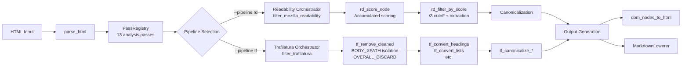

# Architecture of delulu-webfetch

## Elevator Pitch

delulu-webfetch is a **micropass compiler pipeline** for web content extraction. It parses HTML into a DOM tree, runs a sequence of small single-purpose passes (analysis → scoring → filtering → transformation → generation), and produces clean content output. Two extraction strategies are implemented: **Readability** (scoring-based, `rd_*`) and **Trafilatura** (tag-based, `tf_*`). All passes are plain `fn(&mut Vec<DomNode>)` — no traits, no `Box<dyn>`, no dynamic dispatch.

## Diagram



## Modules

| Module | Responsibility | Files |
|--------|---------------|-------|
| **pipeline** | Orchestration, walkers, error model | `pipeline/mod.rs`, `pipeline/walkers.rs`, `pipeline/error.rs` |
| **pipeline/passes** | Analysis, filter, transform, scoring | `passes/rd_*.rs`, `passes/tf_*.rs`, `passes/datatypes.rs` |
| **generators** | Output format: HTML and Markdown | `generators/gen_html.rs`, `generators/gen_md.rs` |
| **core** | HTTP client, URL detection, result types | `core/http.rs`, `core/detect.rs`, `core/types.rs` |
| **sources** | Platform-specific extractors (Reddit, Discourse) | `sources/reddit.rs`, `sources/discourse.rs` |

## Pass Categories

| Category | What it does | Examples |
|----------|-------------|---------|
| **Analysis** | Pure reads — produce metadata strings on each node | `analyze_link_density`, `analyze_text_density`, `analyze_comma_count` |
| **Scoring** | Compute content scores (accumulated, distance-divided) | `rd_score_node` |
| **Filter** | Remove non-content elements | `rd_filter_by_score`, `tf_remove_cleaned`, `tf_remove_unlikely_candidates` |
| **Transform** | Rename/mutate elements | `tf_convert_headings`, `canonicalize_unwrap_containers` |
| **Generation** | Serialize DOM tree to output format | `dom_nodes_to_html`, `MarkdownLowerer::lower` |

## Two Pipeline Architectures

### Readability (`rd_*`)
- **Approach**: Score every element, filter by threshold
- **Scoring**: Accumulated content score with distance-based division (matches JS `scoreDivider`)
- **Filtering**: `/3` ancestor cutoff via candidate extraction + parent-path index
- **Retry**: 4 levels (Strict → Keep Unlikely → Ignore Class Weights → No Score Filter)
- **Output**: Full HTML tree (canonicalization strips scripts/unwraps containers before generation)

### Trafilatura (`tf_*`)
- **Approach**: Tag-based removal + conversion (no scoring)
- **Filtering**: MANUALLY_CLEANED tags, OVERALL_DISCARD_XPATH patterns, BODY_XPATH container isolation
- **Transforms**: Heading/list/quote/formatting tag conversion (matching Trafilatura's XML schema)
- **Retry**: 3 levels (Balanced → Precision → Recall) with backup/restore safety
- **Output**: Same generators as Readability (format mapping after canonicalization)

## Walkers

| Walker | Location | Order | Callbacks | Error Model |
|--------|----------|-------|-----------|-------------|
| `walk_pre_mut` | `pipeline/mod.rs` | Pre-order | Single `Fn(&mut DomNode) -> VisitAction` | Panic |
| `walk_post_mut` | `pipeline/walkers.rs` | Post-order | Multi `&mut [&mut WalkerFilter]` | `Result<bool, PipelineError>` |

`walkers.rs` is the "destination architecture" — all single-callback passes should eventually migrate to multi-callback for batched traversals.

## Key Data Flows

### Readability Extraction
```
HTML → parse_html → analysis passes (13) → rd_score_node (distance division)
  → rd_filter_by_score (/3 cutoff → candidate extraction → sibling scan)
  → transforms (10+) → canonicalization (strip + unwrap) → gen_html/gen_md
```

### Trafilatura Extraction
```
HTML → parse_html → analysis passes (13) → tf_remove_cleaned (52 tags)
  → tf_remove_teaser (TEASER_DISCARD_XPATH)
  → tf_remove_unlikely_candidates (OVERALL_DISCARD_XPATH Patterns 1+2)
  → tf_strip_unwrapped (MANUALLY_STRIPPED tags)
  → tf_remove_empty_cut → tag conversions (6 passes)
  → tf_filter_by_link_density → canonicalization (strip + unwrap)
  → gen_html/gen_md
```

## Key Decisions

- **[ADR-004]** Tattletale pattern: scores ARE the marks — no mark-and-sweep flags (see HANDBOOK.md)
- **[ADR-007]** Function-pointer pass interface: all passes are `fn(&mut Vec<DomNode>)` — no Pass trait
- **Distance-based division**: Score propagation matches JS `scoreDivider` (0→1.0, 1→2.0, n≥2→n*3.0)
- **No scoring in tf_***: Trafilatura strategy uses tag-based removal, not scoring
- **Separate rd/tf files**: Pipelines share walker infrastructure but NOT filter/transform passes (split after spec-design session at commit 1e10974)

## Cross-Cutting Concerns

- **Error model**: Single `PipelineError::ParseError(String)` — all other failures panic (pre-alpha)
- **Clipping**: `.max(0.0)` not `.clamp(0.0, 1.0)` — scores can exceed 1.0
- **Input guard**: `INPUT_NODE_LIMIT = 10_000` skips retry cascade for huge trees
- **Measurement**: `content_score = edit_distance / reference_words` (word-level multiset)

## Trade-offs

- **Backup/restore in tf_***: Safety net prevents content loss but can mask over-removal bugs. 86% threshold may be too conservative for paywall pages where preview text is most of the static content.
- **`has_likely_content` guard in rd_***: Protects against over-removal in Readability. Removed in tf_* to match Trafilatura behavior. Causes aclu.org regression.
- **No BODY_XPATH for rd_***: Readability uses scoring, not container isolation. Trafilatura needs BODY_XPATH because it doesn't score.

## Glossary

| Term | Definition |
|------|-----------|
| **micropass** | A single `fn(&mut Vec<DomNode>)` that does one thing. No traits, no structs. |
| **Readability** | Mozilla's algorithm: score every element, filter by score threshold |
| **Trafilatura** | Python library: tag-based removal + XPath container extraction |
| **tattletale** | Pattern: compute once during scoring, read O(1) in filters (no marking passes) |
| **BODY_XPATH** | Trafilatura's XPath cascade for finding the main content container |
| **OVERALL_DISCARD_XPATH** | Trafilatura's discard patterns (class/id-based element removal) |
