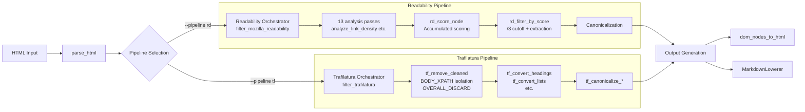

# Architecture of delulu-webfetch

## Elevator Pitch

delulu-webfetch is a **micropass compiler pipeline** for web content extraction. It parses HTML into a DOM tree, then runs a sequence of small single-purpose passes to produce clean content output. Two extraction strategies are implemented, each with a fundamentally different approach:
- **Readability** (`rd_*`): scoring-based — analysis → scoring → filtering → transformation → generation
- **Trafilatura** (`tf_*`): tag-based removal — no content scoring (it only invokes the mark-only analysis pass `mark_data_tables_by_structure`), purely rule-based filtering and tag conversion
All passes are plain `fn(&mut DomNode)` — no traits, no `Box<dyn>`, no dynamic dispatch.

## Diagram



## Modules

| Module | Responsibility | Files |
|--------|---------------|-------|
| **pipeline** | Orchestration, walkers, error model | `pipeline/mod.rs`, `pipeline/walkers.rs`, `pipeline/error.rs` |
| **pipeline/passes** | Analysis, filter, transform, scoring | `passes/rd_*.rs`, `passes/tf_*.rs`, `passes/datatypes.rs` |
| **generators** | Output format: HTML and Markdown | `generators/gen_html.rs`, `generators/gen_md.rs` |
| **core** | HTTP client, URL detection, result types | `core/http.rs`, `core/detect.rs`, `core/types.rs` |
| **sources** | Platform-specific extractors (Reddit, Discourse) | `sources/reddit.rs`, `sources/discourse.rs` |

## Pass Categories

| Category | Pipeline | What it does | Examples |
|----------|----------|-------------|---------|
| **Analysis** | Readability only | Pure reads — produce metadata strings on each node | `analyze_link_density`, `analyze_text_density`, `analyze_comma_count` |
| **Scoring** | Readability only | Compute content scores (accumulated, distance-divided) | `rd_score_node` |
| **Filter** | Both | Remove non-content elements | `rd_filter_by_score` (rd), `tf_remove_cleaned` (tf), `tf_remove_unlikely_candidates` (tf) |
| **Transform** | Both | Rename/mutate elements | `tf_convert_headings` (tf), `canonicalize_unwrap_containers` (both) |
| **Generation** | Both | Serialize DOM tree to output format | `dom_nodes_to_html`, `MarkdownLowerer::lower` |

**Note:** Trafilatura does not score content and runs no Readability-style scoring phase. It invokes the mark-only analysis pass `mark_data_tables_by_structure` (which marks table nodes for later handling) before proceeding directly from parsing to tag-based filtering.

## Two Pipeline Architectures

### Readability (`rd_*`)
- **Approach**: Score every element, filter by threshold
- **Scoring**: Accumulated content score with distance-based division (matches JS `scoreDivider`)
- **Filtering**: `/3` ancestor cutoff via candidate extraction + parent-path index
- **Retry**: 4 levels (Strict → Keep Unlikely → Ignore Class Weights → No Score Filter)
- **Output**: Full HTML tree (canonicalization strips scripts/unwraps containers before generation)

### Trafilatura (`tf_*`)
- **Approach**: Tag-based removal + conversion (no scoring)
- **Filtering**: MANUALLY_CLEANED tags, OVERALL_DISCARD_XPATH patterns, BODY_XPATH container isolation
- **Transforms**: Heading/list/quote/formatting tag conversion (matching Trafilatura's XML schema)
- **Retry**: 3 levels (Balanced → Precision → Recall) with backup/restore safety
- **Output**: Same generators as Readability (format mapping after canonicalization)

## Walkers

| Walker | Location | Order | Callbacks | Error Model | Used By |
|--------|----------|-------|-----------|-------------|---------|
| `walk_pre_mut` | `pipeline/mod.rs` | Pre-order | Single `Fn(&mut DomNode) -> VisitAction` | Panic | Trafilatura (tf_* passes), simple traversals |
| `walk_post_mut` | `pipeline/walkers.rs` | Post-order | Multi `&mut [&mut WalkerFilter]` | `Result<bool, PipelineError>` | Trafilatura (backup wrappers, tag catalog) |
| `walk_post_acc_mut` | `pipeline/walkers.rs` | Post-order | Accumulating | `Result<bool, PipelineError>` | Readability (scoring with child accumulation) |

`walkers.rs` is the "destination architecture" — all single-callback passes should eventually migrate to multi-callback for batched traversals.

## Micropass Design

### Philosophy

Each pass does exactly one thing. A pass is a plain `fn(&mut DomNode)` (or `fn(&mut DomNode) -> WalkerAction`).
No traits, no structs, no dynamic dispatch. Passes are composed into pipelines as `&[PassFn]` arrays.

```rust
// PassFn = fn(&mut DomNode)
pub static TF_BALANCED: Lazy<&[PassFn]> = Lazy::new(|| {
    &[
        tf_protect_content_forms,       // marks forms >90% page as protected
        tf_extract_script_templates,      // extracts Blogger template content
        tf_remove_cleaned,                 // removes 39 boilerplate tags
    ]
});
```

### Pass Signatures

| Signature | Used for | WalkerAction semantics |
|-----------|----------|----------------------|
| `fn(&mut DomNode)` | Transform/analysis passes that never remove | N/A — pass mutates in place |
| `fn(&mut DomNode) -> WalkerAction` | Filter passes that may remove | `Continue` / `Remove` / `SkipChildren` / `ReplaceWithChildren` |
| `fn(&mut DomNode) -> Result<bool, PipelineError>` | Fallible passes (walkers) | Return `Ok(true)` = modified, `Ok(false)` = unchanged |

### Walker Choice

| If your pass... | Use | Reason |
|----------------|-----|--------|
| Removes elements by tag/attribute | `walk_pre_mut` | Pre-order: see parent before children, remove entire subtrees efficiently |
| Replaces elements with children (e.g., unwrap) | `walk_post_mut` | Post-order: children already processed, safe to splice |
| Needs backup/restore (destructive pass) | `walk_post_mut` wrapper | Measure output before/after, restore if too much removed |
| Accumulates child scores upward | `walk_post_acc_mut` | Post-order with child aggregation (Readability only) |

**Rule:** Pre-order is the default for simple removal passes. Post-order is required for `ReplaceWithChildren`.
Using `walk_pre_mut` with `ReplaceWithChildren` panics at runtime.

### Pass Naming Conventions

| Prefix | Pipeline | Example |
|--------|----------|--------|
| `tf_*` | Trafilatura | `tf_remove_cleaned`, `tf_filter_by_link_density` |
| `rd_*` | Readability | `rd_score_node`, `rd_filter_by_score` |
| `dl_*` | Download | `dl_arxiv`, `dl_doc` |

**Verb conventions:**
- `tf_remove_*` — removes matching elements from the tree
- `tf_filter_by_*` — removes elements based on computed property (link density)
- `tf_convert_*` — renames tags (e.g., `<b>` → `<hi rend="#b">`)
- `tf_canonicalize_*` — structural cleanup (strip non-content, unwrap containers)
- `tf_protect_*` — marks elements as protected via metadata (not removal)
- `tf_extract_*` — extracts content from special elements (scripts, templates)
- `tf_fallback_*` — fallback strategy when primary isolation fails
- `apply_*_with_backup` — wraps a destructive pass with backup/restore safety
- `collect_*` / `count_*` / `measure_*` — read-only helpers returning `String` or `usize`

### File Organization

| File | Contains |
|------|----------|
| `passes/tf_filters.rs` | Trafilatura filter passes (removal decisions) + helper functions |
| `passes/tf_transforms.rs` | Trafilatura transform passes (tag conversion, canonicalization) |
| `passes/rd_analysis.rs` | Readability analysis passes (signal computation) |
| `passes/rd_filters.rs` | Readability filter passes (scoring, removal) |
| `passes/rd_transforms.rs` | Readability transform passes |
| `passes/rd_utils.rs` | Readability shared utilities |
| `passes/rd_extraction.rs` | Readability candidate extraction |
| `passes/dl_arxiv.rs` | ArXiv PDF download pass |
| `passes/dl_doc.rs` | Document conversion pass |
| `passes/mod.rs` | Module re-exports only |

**Rule:** Filter and transform passes are in separate files. A pass that both filters and transforms should be split into two passes.

### Doc Comment Convention

Every public pass function must have:

1. **Description** — what the pass does, in one sentence
2. **Pre conditions** — what must be true before this pass runs (e.g., "DOM tree is fully parsed")
3. **Post conditions** — what is guaranteed after this pass runs (e.g., "Elements with unlikely class/id patterns are removed")
4. **Python reference** — if porting from trafilatura, link to the source line

```rust
/// Remove elements with unlikely-candidate class/id/role patterns.
///
/// Pre: DOM tree is fully parsed, cleaned tags already removed.
/// Post: Elements matching OVERALL_DISCARD_XPATH patterns are removed.
/// Reference: Trafilatura `prune_unwanted_nodes(tree, OVERALL_DISCARD_XPATH, with_backup=True)`
pub fn tf_remove_unlikely_candidates(node: &mut DomNode) -> WalkerAction { }
```

### Backup/Restore Pattern (Trafilatura only)

Destructive passes that could remove too much content use a backup/restore wrapper:

```rust
pub fn apply_tf_filter_by_link_density_with_backup(node: &mut DomNode) {
    let old_len = measure_output(node);
    let backup = node.clone();
    walk_pre_mut(node, &mut [&mut |n| tf_filter_by_link_density(n)]);
    let new_len = measure_output(node);
    if new_len * 5 <= old_len {  // >=80% text removed
        tracing::warn!("link density filter removed >=80% text, restoring backup");
        *node = backup;  // restore
    }
}
```

The threshold `new_len * 5 <= old_len` means "restore if >=80% of text was removed."
This matches Python trafilatura's `with_backup=True` pattern using `deepcopy`.

### Shared Helpers

Helpers that are needed by both pipelines or by the orchestrator are made `pub(crate)`:

| Helper | File | Returns |
|--------|------|---------|
| `collect_text(children)` | `tf_filters.rs` | `String` — concatenated text of all child nodes |
| `get_inner_text(node)` | `tf_filters.rs` / `rd_utils.rs` | `String` — recursive text (raw vs whitespace-normalized) |
| `count_p_text(nodes)` | `tf_filters.rs` | `usize` — total `<p>` text length |
| `count_non_ws_chars(node)` | `trafilatura.rs` | `usize` — non-whitespace char count |
| `measure_output(node)` | `trafilatura.rs` | `usize` — total text length (used for backup/restore thresholds) |

**Naming collision note:** `get_inner_text` exists in both `tf_filters.rs` (raw text, no normalization) and `rd_utils.rs` (whitespace-normalized). The tf_ version may be renamed to `get_raw_inner_text` in the future.
## Key Data Flows

### Readability Extraction (scoring-based)
```
HTML → parse_html → 13 analysis passes → rd_score_node (distance division)
  → rd_filter_by_score (/3 cutoff → candidate extraction → sibling scan)
  → transforms (10+) → canonicalization (strip + unwrap) → gen_html/gen_md
```

The 13 analysis passes compute per-node signals (link density, text density, comma count, etc.).
`rd_score_node` accumulates these into a content score with distance-based division.
Scoring passes never remove nodes — they only write to `DomNode.scores`.
A final commit pass removes nodes below threshold.

### Trafilatura Extraction (tag-based removal, no scoring)
```
HTML → parse_html → tf_remove_cleaned (52 tags) → tf_remove_teaser (TEASER_DISCARD_XPATH)
  → tf_remove_unlikely_candidates (OVERALL_DISCARD_XPATH Patterns 1+2)
  → tf_strip_unwrapped (MANUALLY_STRIPPED tags)
  → tf_remove_empty_cut → tag conversions (6 passes)
  → tf_filter_by_link_density → canonicalization (strip + unwrap)
  → gen_html/gen_md
```

Trafilatura does not score content — it invokes the mark-only analysis pass `mark_data_tables_by_structure` (which marks table nodes for later handling), then immediately removes known-non-content elements
by tag name and XPath pattern, then isolates the content container via BODY_XPATH cascade.
The retry cascade (TF_BALANCED → TF_RECALL → wild p-recovery → JSON-LD rescue) compensates
for the lack of scoring by falling back to progressively more aggressive recovery strategies.
Backup/restore wrappers prevent catastrophic content loss from over-aggressive removal.

## Key Decisions

### Readability-specific
- **[ADR-004]** Tattletale pattern: scores ARE the marks — no mark-and-sweep flags (see HANDBOOK.md)
- **Distance-based division**: Score propagation matches JS `scoreDivider` (0→1.0, 1→2.0, n≥2→n*3.0)

### Trafilatura-specific
- **No scoring in tf_***: Trafilatura strategy uses tag-based removal, not scoring. The `scores` field on `DomNode` is unused in tf_* passes.
- **Retry cascade**: 3 levels (TF_BALANCED → TF_RECALL → wild p-recovery → JSON-LD rescue). Each level triggers when output < thresholds. This matches Python trafilatura's `trafilatura_sequence` 4-stage cascade.
- **Backup/restore wrappers**: `apply_*_with_backup` pattern clones the tree before destructive passes and restores if >80% text is removed. This is the Rust equivalent of Python's `deepcopy` + `with_backup=True` pattern.
- **BODY_XPATH container isolation**: 5-pattern cascade (P0→P4) using `find_first_match` + `container_has_content`. Matches Python's `BODY_XPATH` `[1]` first-match-wins semantics.

### Shared
- **[ADR-007]** Function-pointer pass interface: all passes are `fn(&mut Vec<DomNode>)` — no Pass trait
- **Separate rd/tf files**: Pipelines share walker infrastructure but NOT filter/transform passes (split after spec-design session at commit 1e10974)
- **Pass ordering**: Both pipelines order passes by cost (cheap filters first, expensive transforms last)
## Cross-Cutting Concerns

- **Error model**: Single `PipelineError::ParseError(String)` — all other failures panic (pre-alpha)
- **Clipping**: `.max(0.0)` not `.clamp(0.0, 1.0)` — scores can exceed 1.0 (Readability only)
- **Input guard**: `INPUT_NODE_LIMIT = 10_000` skips retry cascade for huge trees
- **Measurement**: `content_score = edit_distance / reference_words` (word-level multiset)
## Trade-offs

- **Backup/restore in tf_***: Safety net prevents content loss but can mask over-removal bugs. 80% threshold (new_len * 5 <= old_len) may be too conservative for paywall pages where preview text is most of the static content.
- **`has_likely_content` guard in rd_***: Protects against over-removal in Readability. Removed in tf_* to match Trafilatura behavior. Causes aclu.org regression.
- **No BODY_XPATH for rd_***: Readability uses scoring, not container isolation. Trafilatura needs BODY_XPATH because it doesn't score.
- **Retry cascade vs single-pass**: Trafilatura's retry cascade (3 levels + JSON-LD rescue) is inherently more expensive than Readability's single-pass scoring, but produces better results on non-article layouts (forums, CMS pages, form-wrapped content).
## Glossary

| Term | Definition |
|------|-----------|
| **micropass** | A single `fn(&mut Vec<DomNode>)` that does one thing. No traits, no structs. |
| **Readability** | Mozilla's algorithm: score every element, filter by score threshold |
| **Trafilatura** | Python library: tag-based removal + XPath container extraction |
| **tattletale** | Pattern: compute once during scoring, read O(1) in filters (no marking passes). Used in Readability only. |
| **BODY_XPATH** | Trafilatura's XPath cascade for finding the main content container |
| **OVERALL_DISCARD_XPATH** | Trafilatura's discard patterns (class/id-based element removal) |
| **retry cascade** | Trafilatura's fallback strategy: try balanced pipeline, then recall, then wild recovery, then JSON-LD rescue |
